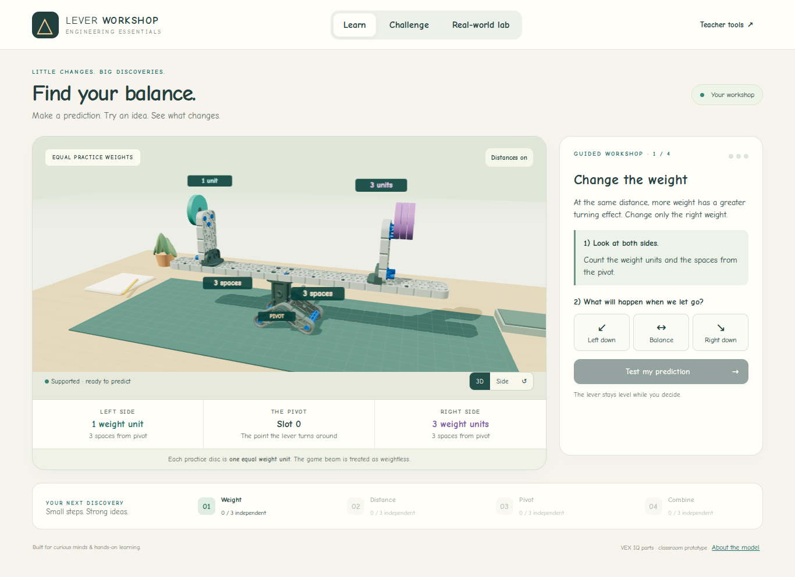

# Lever Workshop

A small browser workshop for Engineering Essentials: recognize a VEX IQ lever, predict what will happen, change one thing, test it, and explain the result.

**Classroom prototype — physical build verification and a school-device check remain required.** The real-world view records student observations; it is not a calibrated digital twin.



## Included

- Original VEX IQ part meshes in a 3D tabletop workshop, with side view and camera reset.
- Four guided skills: weight, distance, pivot, and combined changes.
- 678 checked, solvable challenge arrangements; discrete slots and three equal practice-weight levels.
- Three independent successes per skill, with worked examples and fresh follow-up practice.
- Six-round challenges, with optional 3-minute or 5-minute timing.
- Physical checkpoints using the packet's actual gear recipes, movable brackets and pivot, and manually recorded observations.
- Local progress, teacher controls, downloadable practice evidence, keyboard controls, reduced motion, and a diagram fallback.
- Static GitHub Pages build; no account, backend, analytics, or runtime CDN.

Practice discs are equal units. The real large-gear and large-plus-small assemblies are approximately 17 g and 22 g and are **not** treated as a 1:2 pair. No Newton conversion is needed. See the [teacher guide](docs/TEACHER-GUIDE.md) for model boundaries and the physical checklist.

## Run locally

Use Node.js 22 or later.

```sh
npm ci
npm run build
npm run dev
```

Open <http://localhost:4173/LeverWorkshop/>. Serve `dist/` through HTTP; opening the HTML with `file://` is not supported because part meshes are loaded as assets.

```sh
npm test
npx playwright install chromium
npm run test:browser
```

The browser test starts its own server when needed. `CHROMIUM_EXECUTABLE` optionally selects an existing Chromium binary. `BROWSER_SOFTWARE_GL=1` enables software WebGL for headless Linux test environments.

## GitHub Pages

After reviewing and merging the PR, open **Settings → Pages → Build and deployment → Source → GitHub Actions**. Run **Deploy Pages** manually from the Actions tab. Subsequent pushes to `main` run tests and deploy automatically. The expected URL is <https://abbyusesaithatcodes.github.io/LeverWorkshop/>; this URL is not a claim that deployment has already succeeded.

The workflow builds with `npm ci`, tests the mechanics, and uploads only `dist/`. It does not publish source curriculum PDFs. PR checks build and test without deploying.

## Structure

- `src/model.js`: independent, deterministic lever rules and challenge generation.
- `src/scene.js`: original part meshes, assembly transforms, scene, and camera.
- `src/app.js`: lesson progression, physical observations, timer, and local evidence.
- `public/`: static page, styles, and compressed part meshes.
- `docs/`: teacher guide, validation notes, and CAD provenance.
- `tests/`: model coverage and student browser walkthrough.

See [third-party notices](THIRD_PARTY_NOTICES.md). VEX Robotics is not affiliated with this independent classroom project. Learning Compass is a future integration, not part of this release.
