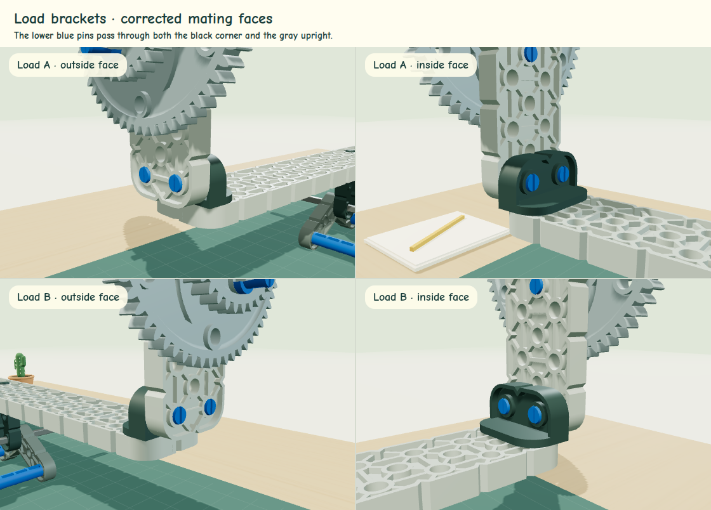

# Mechanics and assembly assumptions

The scene and the physics use the same component list from `src/assembly.js`. A corrected connector cannot silently use a different lever arm in the simulation.

## Coordinates and shaft attachment

One coordinate unit is a VEX IQ hole pitch: 12.7 mm. World X follows the beam, Y is vertical, and Z follows the shaft. The shaft axis is the moving assembly's origin. Gravity is vertical. Only rotation about that shaft is simulated.

The source offset connector has mounting-pin columns at local X = 0 and 1, and a lower through-hole centered at **X = 0.5, Z = −2**. Rotation maps that source Z direction into world Y. Near and far connectors are mirrored so that both lower hole centers map to **X = 0, Y = 0** at all beam angles. The beam center is 2.24 pitches above the shaft. The two central mounting columns, 10 and 11, straddle the shaft equally.

The previous release translated the connectors by a full pitch instead of half a pitch, leaving the shaft detached. Its teacher guide repeated that mistaken interpretation; both are corrected here.

The mounting constraints reserve the pivot's two columns. For load columns `a`, `b` and first pivot column `p`, legal arrangements satisfy `1 ≤ a < p`, `p + 1 < b ≤ 20`. There are 969 legal triples. Each load has five gear-count settings, 0–4.

## Load-bracket attachment

The corner connector's outer flange face is 0.490157 hole pitches outward from the load's mounting column. The upright is 0.480315 pitches thick, so its center sits 0.730315 pitches outward, with its inner face touching that flange. Both loads use mirrored copies of these measured CAD offsets.

The two lower 1x1 pins are centered at the corner/upright interface. Their two ends fill the two joining parts, with only the CAD snap tips extending about 0.04 mm past the exposed faces. The three upper mounting pins use the separate upright/first-gear interface at 0.970472 pitches. The gear stack follows the upright outward; its recipes and spacing are unchanged.

The earlier assembly overlapped the corner and upright by roughly 3 mm and incorrectly placed the lower pins at the upper joint's depth. The corrected shared transforms update both the rendered parts and their physical centers of mass.



## CAD mass properties

`scripts/measure-cad.py` computes each closed OBJ mesh's signed tetrahedron volume, volume centroid, and inertia per unit mass. Coordinates are converted to hole pitches first; the shaft/collar source uses inches and the remaining meshes use millimeters. The generated `src/part-properties.json` is committed. Regeneration requires NumPy and the original named CAD files listed by `docs/cad-provenance.json`:

```sh
python scripts/measure-cad.py /path/to/named/obj/files
```

For moving part `i`, its CAD centroid is rotated and translated by the same transform used in the scene. Intrinsic inertia is rotated into the shaft direction, then the parallel-axis theorem adds `mᵢ(xᵢ² + yᵢ²)`. The fixed base, shaft, collar, and base standoffs do not rotate and do not contribute to moving inertia.

This assumes each part has uniform density. It does not account for manufacturing variation, flexibility, loose pin connections, or shaft bending. Meshes are original CAD; the complete assembled fit has not been physically verified here.

## Mass inputs

| Input                                     | Default        | Basis                                 |
| ----------------------------------------- | -------------- | ------------------------------------- |
| Bracket, upright, and five permanent pins | 6 g            | Build packet approximation            |
| Large gear and three added pins           | 11 g           | Build packet approximation            |
| Small gear and three added pins           | 5 g            | Build packet approximation            |
| Beam                                      | about 19.183 g | CAD volume × inferred plastic density |
| One pin                                   | about 0.1281 g | Same inferred density                 |
| One offset connector                      | about 1.8274 g | Same inferred density                 |

Density is inferred from the 6 g bracket assembly and its CAD volume, approximately 1.048 g/cm³. The bracket mass left after its five pins is allocated to the corner and upright in proportion to their CAD volumes. Each gear's bare mass is its pack mass minus three pin masses. This prevents double counting. These defaults are packet approximations and inferences, not fresh measurements.

Load steps alternate large, small, large, small gears along the outward stack direction. The rendered centers of those stacked gears enter the turning-moment calculation, so adding gears changes both load mass and its center of mass. Every added gear brings three pins. The fit of the longer stacks needs a physical check.

## Rotation

For an angle `θ` counterclockwise from level, a component's horizontal arm is:

`xᵢ(θ) = xᵢ cos θ − yᵢ sin θ`

The physical model uses standard gravity, `g = 9.80665 m/s²`, internally. Student controls do not require force-unit conversions. After grams and hole pitches are converted to SI units:

`τ(θ) = −g Σ mᵢ(xᵢ cos θ − yᵢ sin θ)`

`I α = τ − shaft resistance − velocity damping`

Equivalently, potential energy is `U(θ) = g Σ mᵢ(xᵢ sin θ + yᵢ cos θ)`, and `τ = −dU/dθ`. A numerical test checks that relationship. The level turning effect can also be read in grams × hole spacing; that is the unit used for the teacher resistance control.

The loads' centers of mass are above the shaft. A symmetric level configuration is therefore an unstable equilibrium in the frictionless approximation, not a stable spring-centered balance. The starting level state remains still when gravity's turning effect is within the static-resistance threshold. Each edit deliberately returns to level. Reduced-motion mode jumps directly to the predicted contact limit.

## Resistance, contact, and numerical integration

Defaults are **0.3 g × hole spacing** for Coulomb/static shaft resistance and **2.4 s⁻¹** for velocity damping. Neither is calibrated against the teacher's physical build. Both can be adjusted, including to zero. Near-zero motion can stick if gravity is below the resistance threshold; sliding resistance opposes motion.

Integration uses semi-implicit Euler with substeps no larger than 1/240 s and a 0.1 s maximum elapsed step. Hidden tabs pause the simulation and reset elapsed time on return. No artificial spring torque pulls the beam to level.

Contact angles are found by binary search over all moving components' transformed CAD bounding-box corners. No corner may pass below a plane 0.03 pitches above the mat. This is a **conservative** stop: a bounding-box corner can stop the model before the true curved surface touches. Contact is inelastic (no bounce). The model does not solve collisions between moving parts and the base or simulate the base sliding/tipping. Permitted mounting positions avoid pin-column overlap, not every possible tolerance-related collision.

## Primary references

- [OpenStax: conditions for static equilibrium](https://openstax.org/books/university-physics-volume-1/pages/12-1-conditions-for-static-equilibrium): force and torque balance.
- [OpenStax: examples of static equilibrium](https://openstax.org/books/university-physics-volume-1/pages/12-2-examples-of-static-equilibrium): component weights, lever arms, and center of mass.
- [Three.js OrbitControls](https://threejs.org/docs/pages/OrbitControls.html) and [Raycaster](https://threejs.org/docs/pages/Raycaster.html): camera interaction and direct mesh picking.
